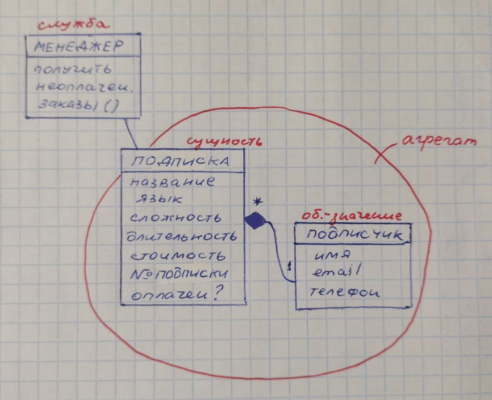

Министерство науки и высшего образования Российской Федерации  
Федеральное государственное бюджетное образовательное учреждение  
высшего образования  
«Московский государственный технический университет  
имени Н.Э. Баумана  
(национальный исследовательский университет)»  
(МГТУ им. Н.Э. Баумана)

ФАКУЛЬТЕТ ИНФОРМАТИКА И СИСТЕМЫ УПРАВЛЕНИЯ  
КАФЕДРА КОМПЬЮТЕРНЫЕ СИСТЕМЫ И СЕТИ (ИУ6)

 

ОТЧЕТ  
к лабораторной работе №2  
по дисциплине "Современные технологии разработки  
программного обеспечения"  
Реализация приложения в многоуровневой архитектуре  
с использованием удалённого репозитория кода

 

Преподаватель: Фетисов М.В.

Студент группы ИУ6-52Б Рожкова Елизавета Александровна.

## Описание задания

Задача № 19: "Онлайн-школа программирования".

Необходимо составить отчёт для обзвона (или для рассылки почтового сообщения) пользователей, которые сформировали заказ, но ещё не выполнили оплату.

## Адрес проекта

Проект хранится в удаленном репозитории по адресу: [https://bmstu.codes/lsx/mstd/iu6-5-2022/iu6-52b-rozhkovaea/l2](https://bmstu.codes/lsx/mstd/iu6-5-2022/iu6-52b-rozhkovaea/l2).

## Документация

Диаграммы классов создаются автоматически при обновлении ветки `master` в удаленном репозитории GitLab и выкладываются в страницы проекта по адресу: [https://lsx.pages.bmstu.codes/mstd/iu6-5-2022/iu6-52b-rozhkovaea/l2/](https://lsx.pages.bmstu.codes/mstd/iu6-5-2022/iu6-52b-rozhkovaea/l2/).

Отчёт о покрытии тестами создаётся автоматически при обновлении ветки `master` в удаленном репозитории GitLab и выкладываются в страницы проекта по адресу: [https://lsx.pages.bmstu.codes/mstd/iu6-5-2022/iu6-52b-rozhkovaea/l2/coverage](https://lsx.pages.bmstu.codes/mstd/iu6-5-2022/iu6-52b-rozhkovaea/l2/coverage).

## Модель

Диаграмма объектов модели с выделенными сущностями, значениями, службами и агрегатом:

## Выводы

В ходе выполнения лабораторной работы было освоено проектирование по модели (_MDD_): в предментной области выделены сущность, объект-значение, служба и агрегат. Проведен углубляющий рефакторинг написанной ранее программы. Добавлена новая функциональность, пройден сценарий непрерывной интерграции.
